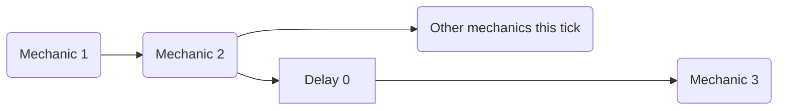
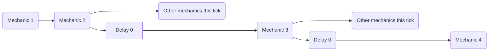

The [delay] mechanic can be used to apply a delay not only *between* ticks, but also inside of the same tick via a `delay 0` mechanic. 

# DISCLAIMER
This is not an intended mechanic. It's just a side-effect that consistently works because of how the plugin's scheduler operates  

While i have extensively tested this behavior after discovering it before documenting it, it's still very possible that new applications or game-breaking behaviors are still present. If you have any information useful to further expand this page and, by proxy, the knowledge available to every other MythicMobs user, let me know: [Lxlp's Discord Profile](https://discord.com/users/353257382811533322)

## Single Delay

You have to imagine each mechanic as a series of instructions that are executed orderly. In this scenario, using a `delay 0` mechanic allows you to "schedule" the subsequent mechanics to be executed *after* every other non delayed mechanic that tick.



### Example
```yaml
ExampleMechanic:
  Skills:
  - skill{s=Skill1} @self
  - skill{s=Skill2} @self

Skill1:
  Skills:
  - delay 0
  - message{m="<skill.var.test>"}

Skill2:
  Skills:
  - setvariable{var=test;val=1}
```
> Executing the ExampleMechanic will output
>> - `UNDEFINED` if no delay 0 is used
>> - `1` otherwise

## Multiple Delays
This behavior works with multiple delays too: each time a new `delay 0` is executed, the subsequent mechanics are pushed a the back of the execution line *again*




### Example
```yaml
ExampleMechanic:
  Skills:
  - skill{s=SkillMessage} @self
  - skill{s=Skill1} @self
  - skill{s=Skill2} @self

Skill1:
  Skills:
  - delay 0
  - setvariable{var=test;val=2}

Skill2:
  Skills:
  - setvariable{var=test;val=1}

SkillMessage:
  Skills:
  - delay 0
  - delay 0
  - message{m="<skill.var.test>"}
```
> Executing the ExampleMechanic will output
>> - `UNDEFINED` if no delay 0 is used inside of SkillMessage
>> - `1` if only one delay 0 is used inside of SkillMessage
>> - `2` if all delays are used inside of SkillMessage


## Examples
```yaml
ExampleSkill:
  Cooldown: 0
  OnCooldownSkill: ExampleSkill-DisplayCooldown
  Skills:
  - delay 0
  - setSkillCooldown{s=ExampleSkill;seconds=<skill.cooldown>/20} @self
```
> In this example if no `delay 0` is set then the `setSkillCooldown` would have run regardless, but the new cooldown value would have been overridden by ExampleSkill's, as the cooldown for the metaskill is set *after* any non delayed mechanics in the metaskill are executed.  
> Using a `delay 0` allows to apply a delay to the setSkillCooldown mechanic, allowing it to set the cooldown *after* ExampleSkill's has been set *without* needing to wait for an extra tick, which could have allowed for possible edge cases to cause a bug


```yaml
ExampleSkill:
  Skills:
  - delay 0 ?variableisset{var=caster.example}
  - message{m=<caster.var.example>} @self
```
> In this example a delay 0 is used to give a variable enough time to be set before its value is fetched. This has the drawback of making it impossible to exactly know beforehand how many intratick delays will be applied, but if, on the contrary, it's not already know how many intraticks will be needed to set the variable this can be a valuable tradeoff


<!-- LINKS -->
[delay]: /Skills/Mechanics/delay