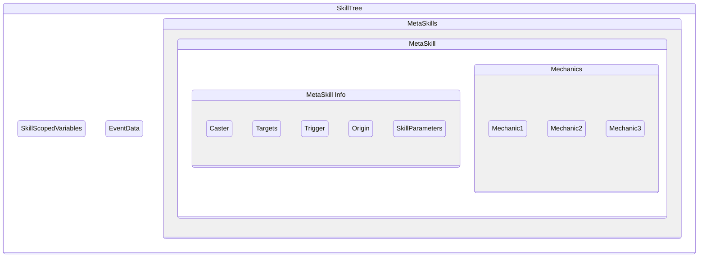

SkillTrees are an implicit feature of Mythic and, while they cannot be directly invoked like [Metaskills] or other features, play just as important a role.  

SkillTrees are **created each time a mechanic is fired by a trigger**, and it is the place where skill scoped [variables] are stored and inside which [metaskills] exist

[[_TOC_]]

# SkillTree Structure

## Skill Scoped Variables

Since they exist in the skilltree itself, skill-scoped variables can be accessed and modified by any [metaskill] in the skilltree from the moment they are created, regardless of which [metaskill] created them

## Event Data
The skilltree always knows which event triggered it, and allows the [cancelevent](/Skills/Mechanics/cancelevent) mechanic to be used in any of the metaskill it calls in order to cancel it, as long as this occurs in a synched manner

## MetaSkills
Each [Metaskill] that is being called in the SkillTree has its own set of data regarding different elements.
Normally, the value of those elements is copied over from the calling metaskill unless overridden.  
Those elements are:
### `Caster`
The entity casting the metaskill.
  - Can be changed via the use of the [sudoskill] mechanic
### `Target`
It is the [Inherited Target](/Skills/Metaskills#inheritance) of the metaskill

### `Trigger`
Is first set as the entity that triggered the SkillTree initially, and one can fetch this entity via the [@trigger] targeter or other similar targeters. Depending on the [~Trigger] used, a [@trigger] may not exist.
  - The `Trigger` can be changed via the use of the [sudoskill] mechanic's `casterastrigger` attribute, which will make the called metaskill have, as the  `Trigger`, the `Caster` of the original metaskill 
### `Origin`
It's the [@origin] of the metaskill. By default, it is the position of the `Caster`.
  - Can be set via the `origin` [universal attribute]
  - It is automatically set in mechanics such as [projectile](/Skills/Mechanics/Projectile)
### `Skill Parameters`
The [Skill Parameters] of the metaskill. Please note that, contrary to [Skill Scoped Variables](#skill-scoped-variables), they do not exist on the skilltree itself. 

<!-- LINKS -->
[metaskill]: /Skills/Metaskills
[metaskills]: /Skills/Metaskills
[variables]: /Skills/Variables
[sudoskill]: /Skills/Mechanics/SudoSkill
[~Trigger]: /Skills/Triggers
[@trigger]: /Skills/Targeters/Trigger
[@origin]: /Skills/Targeters/Origin
[universal attribute]: /Skills/Mechanics#universal-attributes
[Skill Parameters]: /Skills/Metaskills#skill-parameters-premium-feature